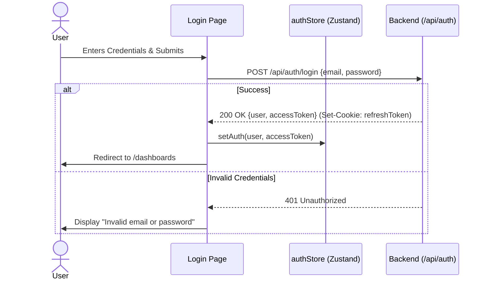

# Frontend Specification: Authentication Module

## 1. Purpose
To provide a secure, seamless, and visually premium authentication and authorization experience for the Altzor Analytics platform. This module manages user identity, session lifecycle, organization routing, and role-based access control (RBAC).

## 2. Goals
- Deliver a frictionless login/signup experience inspired by Cursor and Linear.
- Handle JWT lifecycle (access and refresh tokens) transparently via Axios interceptors.
- Manage user state globally via Zustand with robust local persistence.
- Enforce RBAC at the route and component levels.

## 3. Architecture
The authentication module operates entirely on the client side, interacting with the existing Express.js backend. It leverages React Router for protected route guards and Zustand for reactive state binding across the application shell.

### 3.1 Folder Structure
```text
apps/web/src/
├── features/auth/
│   ├── components/
│   │   ├── LoginForm.tsx
│   │   ├── SignupForm.tsx
│   │   ├── AuthLayout.tsx
│   │   └── ForgotPassword.tsx
│   ├── hooks/
│   │   ├── useLogin.ts
│   │   └── useSignup.ts
│   └── utils/
│       └── jwtDecoder.ts
├── stores/
│   └── authStore.ts
└── pages/
    ├── login.tsx
    └── signup.tsx
```

### 3.2 Responsibilities
- **`authStore.ts`**: Holds the `user` object, `accessToken`, and `isAuthenticated` flag. Syncs with `localStorage`.
- **`LoginForm.tsx`**: Renders the UI, captures credentials, triggers Zod validation, and dispatches the mutation.
- **`api.ts` (Interceptor)**: Catches `401 Unauthorized` responses, hits `/api/auth/refresh`, and retries the original request.

## 4. Sequence Diagrams


## 5. API Contracts (Backend Synchronization)
All endpoints reside on the Express backend under `/api/auth`.

| Action | Method | Endpoint | Payload | Success Response | Error Response |
| :--- | :--- | :--- | :--- | :--- | :--- |
| **Login** | `POST` | `/api/auth/login` | `{ email, password }` | `200 OK`, `{ user, accessToken }`, Cookie: `refreshToken` | `401 Unauthorized` |
| **Refresh** | `POST` | `/api/auth/refresh` | *None (uses HttpOnly Cookie)* | `200 OK`, `{ accessToken }` | `401/403` (Triggers Logout) |
| **Logout** | `POST` | `/api/auth/logout` | *None* | `200 OK` (Clears Cookie) | `500 Server Error` |

**Caching Strategy**: Authentication data is NOT cached by TanStack query. It is strictly maintained in Zustand memory + LocalStorage.
**Optimistic Updates**: None for auth flows.

## 6. UI Specifications

### 6.1 Layout Hierarchy & Wireframe
```text
[ Auth Layout (Full Screen, bg-slate-950) ]
  ├── [ Floating Background Orbs (Framer Motion) ]
  └── [ Center Card (Glassmorphism) ]
       ├── Logo (Altzor)
       ├── Title & Subtitle
       ├── Input: Email
       ├── Input: Password
       ├── Link: Forgot Password?
       ├── Button: Sign In (Gradient)
       └── Link: Create Account
```

### 6.2 Styling Guidelines
- **Typography**: `Inter` or `Geist`. Headings in `font-semibold text-slate-50`. Labels in `text-sm text-slate-400`.
- **Glassmorphism**: `bg-slate-900/50 backdrop-blur-2xl border border-slate-800`.
- **Inputs**: `bg-slate-950/50 border-slate-800 focus:ring-1 focus:ring-blue-500 focus:border-blue-500`.
- **Buttons**: `bg-gradient-to-r from-blue-600 to-indigo-600 hover:from-blue-500 hover:to-indigo-500 shadow-[0_0_20px_rgba(37,99,235,0.2)]`.

### 6.3 Animation Specifications (Framer Motion)
- **Card Entrance**: `initial={{ opacity: 0, y: 20 }} animate={{ opacity: 1, y: 0 }} transition={{ duration: 0.4, ease: "easeOut" }}`.
- **Button Hover**: `whileHover={{ scale: 1.02 }}`
- **Button Tap**: `whileTap={{ scale: 0.98 }}`

### 6.4 States
- **Loading State**: The "Sign In" button text changes to a spinner component (`lucide-react` Loader2 with `animate-spin`). Inputs become `disabled`.
- **Error State**: A `div` appears above the form with `bg-red-500/10 border-red-500/50 text-red-400`. The inputs gain a red border if validation fails.
- **Responsive**: On mobile (`xs`, `sm`), the card border vanishes, and it takes up 100% width and height.

## 7. Edge Cases & Error Handling
- **Token Expiry During Navigation**: Intercepted by `api.ts`. The UI freezes in its current state while the refresh token is exchanged in the background.
- **Refresh Token Expiry**: The user is immediately flushed from `authStore` and forcefully redirected to `/login?session_expired=true`.
- **Brute Force**: Express rate limiters will return `429 Too Many Requests`. The UI must catch `429` and display a countdown or specific warning.

## 8. Acceptance Criteria
1. User can log in with valid credentials and receive an access token.
2. User's access token is automatically attached to subsequent API calls.
3. Refresh token flow happens silently without interrupting user actions.
4. RBAC protects the `/settings` route, allowing only `ADMIN` roles to render the component.
5. UI perfectly matches the $100M SaaS aesthetic with glassmorphism and 60fps animations.
