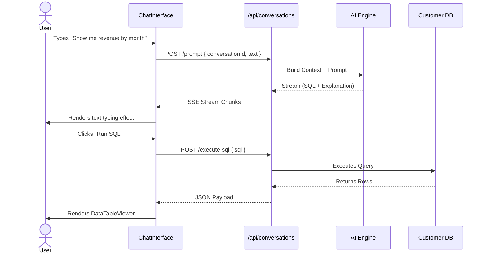

# Frontend Specification: AI Conversation Module

## 1. Purpose
The AI Conversation module is the flagship interface of Altzor Analytics. It allows users to query their connected databases using Natural Language to SQL (NL2SQL), visualize the results instantly, and interact with the data in a chat-based format inspired by ChatGPT and Wisdom AI.

## 2. Goals
- Provide a zero-latency feel for chat interactions with robust streaming text.
- Render generated SQL, explanations, and data tables inline within chat bubbles.
- Allow users to execute, edit, or copy the generated SQL seamlessly.
- Support markdown rendering, chart recommendations, and interactive data grids.

## 3. Architecture

### 3.1 Folder Structure
```text
apps/web/src/
├── features/chat/
│   ├── components/
│   │   ├── ChatInterface.tsx
│   │   ├── MessageList.tsx
│   │   ├── MessageBubble.tsx
│   │   ├── SqlBlock.tsx
│   │   ├── DataTableViewer.tsx
│   │   └── ChatInput.tsx
│   ├── hooks/
│   │   ├── useChatStream.ts
│   │   └── useExecuteSql.ts
│   └── stores/
│       └── activeChatStore.ts
```

### 3.2 Responsibilities
- **`ChatInterface.tsx`**: Orchestrates the layout, holding the `MessageList` and pinned to the bottom `ChatInput`.
- **`useChatStream.ts`**: Manages the SSE (Server-Sent Events) connection to the backend to type out the AI's response in real-time.
- **`SqlBlock.tsx`**: Uses `react-syntax-highlighter` to display the SQL. Includes a "Run Query" button.

## 4. Sequence Diagrams


## 5. API Contracts

| Action | Method | Endpoint | Payload | Response | Notes |
| :--- | :--- | :--- | :--- | :--- | :--- |
| **Send Prompt** | `POST` | `/api/conversations/:id/prompt` | `{ message: string }` | SSE Stream (Text/Markdown) | Backend handles memory appending. |
| **Execute SQL** | `POST` | `/api/query/execute` | `{ sql, connectionId }` | `200 OK`, `{ columns, rows }` | Handled via TanStack Query. |
| **Get History** | `GET` | `/api/conversations/:id/messages`| *None* | `200 OK`, `[Message]` | Fetched on mount. |

## 6. UI Specifications

### 6.1 Layout Hierarchy & Wireframe
```text
[ Sidebar (Left) ] | [ Chat Area (Center, Flex-1) ]
                   |   ├── Header (Chat Title, Model Select, Settings)
                   |   ├── Scrollable Message List
                   |   │    ├── User Bubble (Right Aligned)
                   |   │    └── AI Bubble (Left Aligned)
                   |   │         ├── Markdown Text
                   |   │         ├── Code Block (SQL)
                   |   │         └── Data Table (If executed)
                   |   └── Floating Input Area (Bottom)
                   |        └── Textarea with Auto-resize & Send Button
```

### 6.2 Styling Guidelines
- **Spacing**: `gap-6` between messages. Generous padding (`p-6`) around the main container.
- **Typography**: AI text uses `prose prose-invert`. SQL uses a monospace font (`font-mono text-sm`).
- **Bubbles**: User bubbles are `bg-blue-600 text-white`. AI bubbles are transparent but have a `bg-slate-800/50` border structure.
- **Glassmorphism Input**: The bottom input area sits on a gradient mask `bg-gradient-to-t from-slate-950 to-transparent`. The input itself is `bg-slate-900/80 backdrop-blur-xl border-slate-700 shadow-2xl`.

### 6.3 Animation Specifications
- **New Message**: `initial={{ opacity: 0, y: 10 }} animate={{ opacity: 1, y: 0 }}`
- **Typing Indicator**: Three bouncing dots using `framer-motion` keyframes `[0, -10, 0]`.

### 6.4 States
- **Streaming State**: The markdown parser must safely render incomplete markdown (e.g., unclosed code blocks) using a resilient parser like `react-markdown` with `remark-gfm`.
- **SQL Execution Loading**: A skeleton table loader with shimmering rows.
- **Empty State**: A beautiful center screen showing "What would you like to know about your data?" with 3-4 clickable AI Suggestions cards.

## 7. Edge Cases & Error Handling
- **Hallucinated SQL**: If the AI writes invalid SQL, the user clicking "Run" will trigger a backend Database Error. The UI catches the `400` status and displays a red "Query Failed" alert box within the chat, offering an "Auto-Fix" button that sends the error trace back to the AI.
- **Massive Results**: If the executed SQL returns >10,000 rows, the UI implements virtual scrolling (`@tanstack/react-virtual`) or server-side pagination to prevent DOM crashes.

## 8. Acceptance Criteria
1. Messages are appended instantly optimistically.
2. Markdown renders tables, bolding, and code blocks correctly.
3. The SQL block has a syntax highlighter and a functional copy button.
4. Input textarea auto-resizes up to 200px height.
