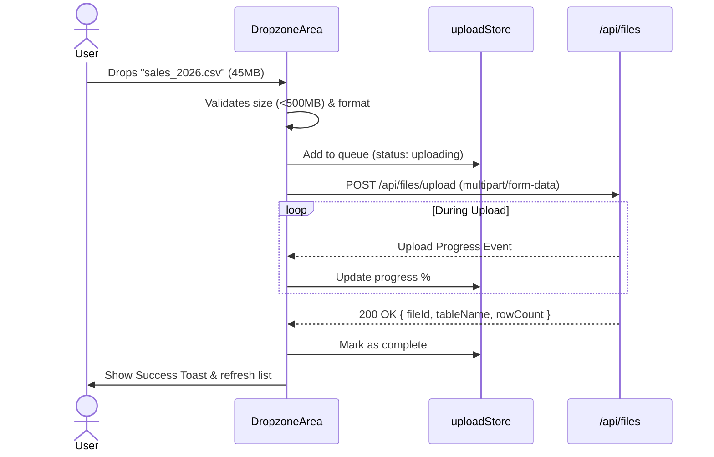

# Frontend Specification: File Upload Module

## 1. Purpose
This module handles the ingestion of static flat files (CSV, XLSX, JSON, PDF). It provides a sleek, drag-and-drop interface with real-time validation, uploading status, and progress indicators, perfectly mirroring modern enterprise file management experiences.

## 2. Goals
- Seamless drag-and-drop zone with visual feedback.
- Client-side pre-validation (size, extension, basic formatting).
- Beautiful progress bars and success/error states per file.
- Direct integration into the backend ephemeral tables.

## 3. Architecture

### 3.1 Folder Structure
```text
apps/web/src/
├── features/uploads/
│   ├── components/
│   │   ├── DropzoneArea.tsx
│   │   ├── UploadQueue.tsx
│   │   ├── FileCard.tsx
│   │   └── DataPreviewModal.tsx
│   ├── hooks/
│   │   ├── useFileUpload.ts
│   │   └── useFilesList.ts
│   └── stores/
│       └── uploadStore.ts
```

### 3.2 Responsibilities
- **`DropzoneArea.tsx`**: Uses `react-dropzone` to handle file drag events and client-side validation.
- **`useFileUpload.ts`**: Handles the `FormData` creation, Axios upload with `onUploadProgress` for percentage tracking, and TanStack query invalidation on success.
- **`UploadQueue.tsx`**: A floating bottom-right panel (like Google Drive) showing active and recently completed uploads.

## 4. Sequence Diagrams


## 5. API Contracts

| Action | Method | Endpoint | Payload | Response | Notes |
| :--- | :--- | :--- | :--- | :--- | :--- |
| **Upload File** | `POST` | `/api/files/upload` | `multipart/form-data` | `200 OK`, `{ fileId, tableName, columns, rowCount }` | Uses multer on backend. |
| **Get Files** | `GET` | `/api/files` | *None* | `200 OK`, `[FileMetadata]` |
| **Delete File** | `DELETE`| `/api/files/:id` | *None* | `200 OK` | Removes from S3 and drops ephemeral table. |

## 6. UI Specifications

### 6.1 Layout Hierarchy & Wireframe
```text
[ Header: "Data Files" | Used: 2.4 GB / 5 GB ]
------------------------------------------------
[ Drag & Drop Zone (Dashed Border, Large Icon) ]
[ "Drag and drop CSV, Excel, JSON, or PDF"     ]
------------------------------------------------
[ Uploaded Files Grid                          ]
[ Card: sales_2026.csv                         ]
[ Size: 45MB | Rows: 1.2M | Status: Ready      ]
[ Actions: [Preview] [Delete]                  ]
```

### 6.2 Styling Guidelines
- **Dropzone**: `border-2 border-dashed border-slate-700 bg-slate-900/30 rounded-2xl`. On `isDragActive`, border becomes `border-blue-500` and background `bg-blue-900/20`.
- **Progress Bar**: `h-2 bg-slate-800 rounded-full overflow-hidden`. Inner bar `bg-gradient-to-r from-blue-500 to-indigo-500`.

### 6.3 Animation Specifications
- **Queue Panel**: Slides up from the bottom right `initial={{ y: 100, opacity: 0 }} animate={{ y: 0, opacity: 1 }}`.
- **File Card Hover**: Slight elevation `whileHover={{ y: -2, boxShadow: "0px 10px 20px rgba(0,0,0,0.2)" }}`.

## 7. Edge Cases & Error Handling
- **File Too Large**: Caught instantly by `react-dropzone` `maxSize`. User gets a shake animation on the dropzone and a red toast error.
- **Upload Interruption**: If the network drops, Axios throws a network error. The file status in `uploadStore` goes to `failed`, showing a red retry button.

## 8. Acceptance Criteria
1. User can upload multiple files simultaneously.
2. The UI accurately reflects real-time upload progress via XHR/Axios events.
3. Successfully uploaded files immediately appear in the queryable data list (TanStack optimistic cache update).
